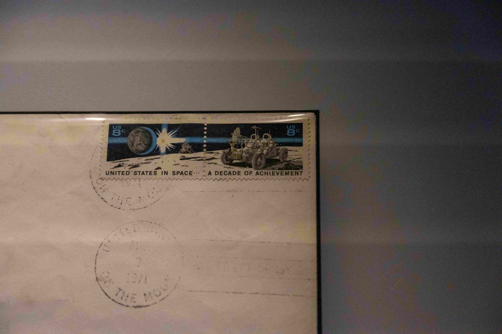
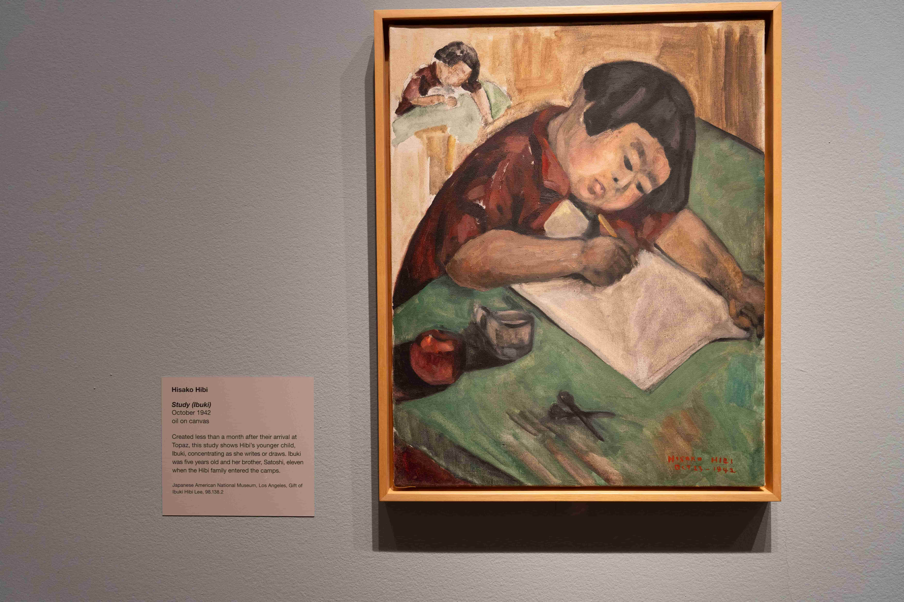
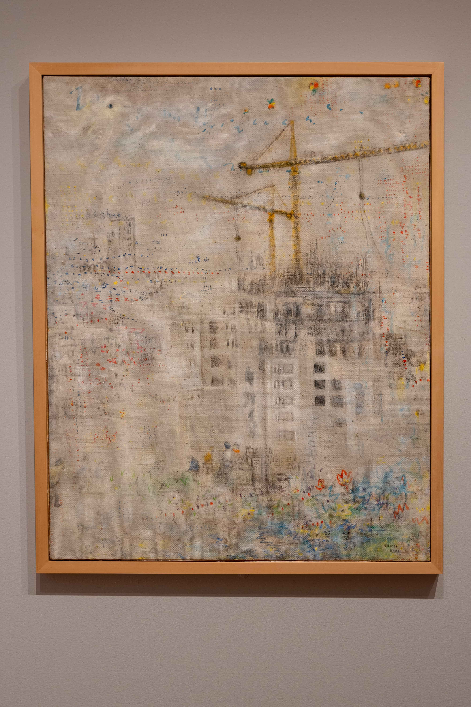
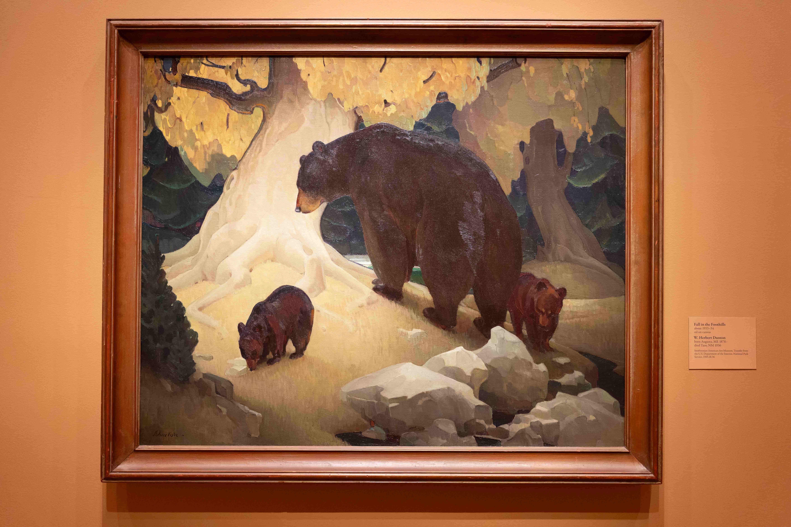
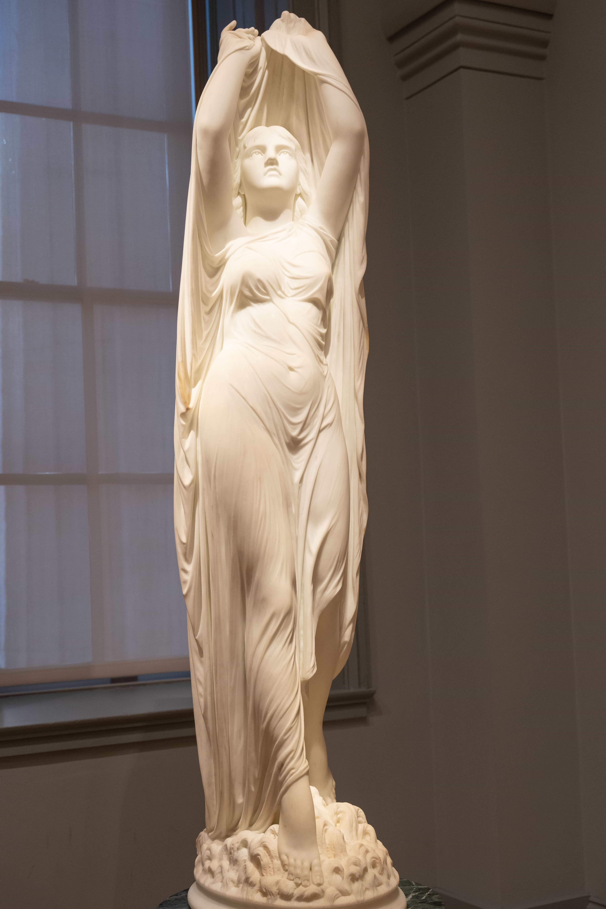
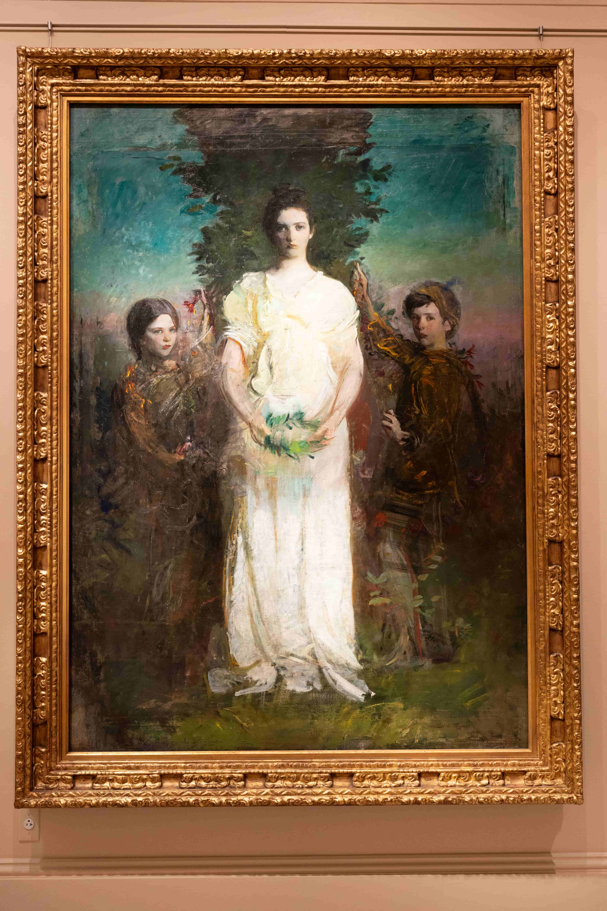
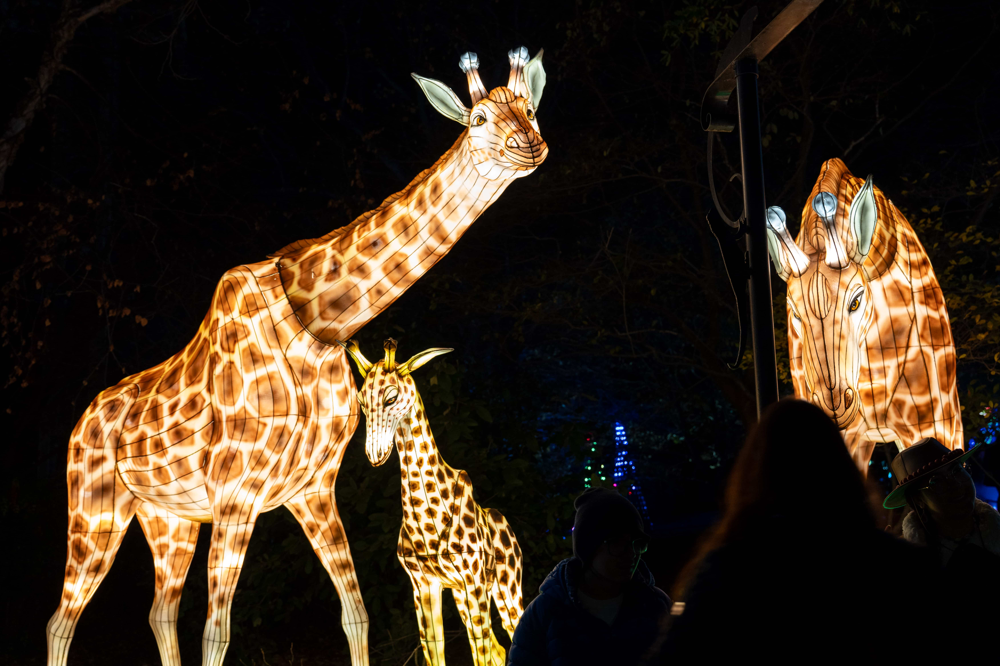

因为这是第二次去 DC 玩，所以本文叫 DC 游记 2，那么我会补上 DC 游记 1 吗？感觉不太可能，一方面我确实懒惰，另一方面好几个月过去了记忆已经不那么清晰了，但是第一次去游玩的一些经历大概会在本篇当中出现。不过也有可能为了当时拍的照片特地开一个博文，谁又知道呢？

当然说到照片，我的相机也是在上次去 DC 玩之前买的。那次去 DC 玩是 predoc 工作结束之后、博士项目开学之前。在搬家的一片混乱之中，我买了相机和相机包，对着 B 站和 Youtube 上的各种视频进行相机入门。刚刚拿到相机不是很熟练，照片拍完回来一看，那叫一个惨不忍睹——并不是说好几个月之后的这次行程拍的照片就忍睹了，毕竟这好几个月也没再练习，甚至当年看这视频设置的自定义键位都忘得差不多了，只能站在人来人往的景点里摸了三个键才想起来怎么改对焦模式。但是有相机之后旅游变得更好玩了！因为看着景色会想能不能拍出来好看的照片，所以旅游途中出现了一些打游戏找隐藏的快乐。

于是上一次手忙脚乱地搬家之后，趁着邮走的行李还在路上，新的公寓还没开始，我跑到了 DC 找三木玩。三木那段时间刚刚结束了一个案子，比较清闲，带着我每天白天都玩得很累吃得很好，晚上还都会找地方喝一杯——当然我不喝看他喝。那次待了四天，当时正值七月底，天气十分炎热，每天在室外走的时候都觉得要去世了。尤其是倒数第二天我一个人去动物园，热得我看两个动物就要躲进纪念品商店吹吹冷气，最后一整片动物都还没看呢就打车跑了。去一次、玩四天当然不可能把好玩的都玩尽了，于是当时就决定今年结束之前再去玩儿一趟。本来想着十月中旬去，结果在我的犹犹豫豫之间，机票价格飞涨，我直接放弃。这个机票价格为我敲响了警钟，我极速开始计划感恩节假期。在几个城市反复犹豫了一番，突然间意外发现去 DC 的往返机票如此便宜，于是就有了这次行程。正好我和三木共同的同学与好友姜母这次也有空，一次能见到两个朋友，对我来说也算一见双雕了。

第一次去 DC 真的毫无计划，因为三木真的很会玩、又对 DC 十分熟悉，于是他说哪儿就去哪儿。这次出门前一天的晚上，我紧急领悟到不能总麻烦别人、还是要自己计划一下，于是开始紧急上网查攻略，当时的心理活动如下：

- 第一次大概看了一眼邮政博物馆，但是真的就进去看了一眼然后出来了，所以这个要去！
- 上次吃的 L'Ardente 实在是太好吃了，羊肉披萨我魂牵梦萦，还要再吃一顿。这事极速告诉了三木，三木极速和姜母确认了一下预约了三个人的座位。用三木的话说就是：好吃的，就是位置不好订。
- 上次 Hirshhorn 地下和三楼的展厅全都关了，没看全十分遗憾，要再去一次。
- 三木说肖像美术馆非常有意思，也要去看。
- 动物园晚上竟然有灯展！想起来小时候看的元宵节灯展，明明小时候都不爱看觉得好俗啊，但是竟然现在想去看。
- 国家广场那边有个植物园，正好上次国家广场也没细逛，去看！
- 还有铸币厂那个导览上次也没去，哦，人家感恩节放假没有安排，算了下次再说。
- 还有之前看网友说秘鲁菜好吃，三木说他家不远处有家秘鲁菜，食!
- 上网看还有个 Tudor place，看着也很有意思，有空也去。（最后没空 ）

虽然看着没几个地方，但是经过最近几次游览我已经领悟，我一天最多逛一个博物馆——甚至一个都不一定逛得完——因此这足够我玩三天的了。于是揣着这一个列表的博物馆了，出发！

## Day 1

### 冻死我了！

我现在住在南方，这个城市的发达程度很像我的东北二线城市家乡。上半年校园参观日的时候，站在市中心博物馆门口看对面的广场，突然想起来了高中父母开车送我回学校的路上路过的一个夏天会架烧烤摊的广场。当时的我绝不会想到，当我真的搬来这座城市之后，我会天天痛骂贵市的气候，甚至恨不得退学重新申请、或者干脆回国不念了。这也时常让我想起来了当年轰动一时的辽宁某年文科高考状元去了港大一个月退学回来复读考北大，我主观臆测她退学的百分之八十的因素是气候。我还总结了一番发现，过去三年没有回国也没有乡愁，可能主要是因为住在北方、气候相似。我可以忍受寒冷的冬天，但是完全受不了漫长的夏天，而这里差不多直到上周还是夏末初秋的气温。每天早上出门的时候，看着气温不高，但是出门体感仿佛当天最高温——尤其是在阳光下——而我也早就在这样的气温里习惯了看着当天的最高温度穿衣服。

于是出发前一天，我看着天气软件里 DC 的最高温，看着可拆卸夹层的外套犹豫再三，把里面的夹层留在了家里，完全忘记了离海洋近的地方体感温度会低一点。等到了 DC 之后，在机场外面的地铁站等地铁，等的那几分钟冻得我四处找能挡风的墙，并且频频想起被我留在家里的内衬——明明箱子里还有地方，怎么就没拿上呢！？！

坐地铁去酒店，随便走了一个出站口对着地图走去酒店。不知道是不是因为狭管效应，那里的风极大，逆着风走真的阻力千钧。走着走着帽子还被吹掉了，我回头追着帽子走，帽子跑得特别快，还是走在我后面的好心路人帮我捡起来的。于是我又重新顶着风走路阻力千钧。就这样终于转到了背风的一边，抬头一看，是地铁的另一个出站口——只能说，往好里想，下次知道从这个口出比较近了。

到了酒店，存了行李，掏出了一件短袖套在卫衣里面，坐在大厅里从博物馆列表里选取幸运博物馆。得知三木和姜母中午有空，就择日不如撞日去吃秘鲁菜。

我深知套一件短袖不能抵御这个温度，趁着时间还早，我跑到了餐馆对面的卖场开始买衬衣。圆领的衬衣面料奇特，高领的衬衣又不完全高领，担心套在卫衣里有点奇怪，就拍下照来去问 partner 这衣服怎么样。  
partner 锐评：学术人最终的归宿，黑色套头高领衫  
一时间感觉有被嘲讽到，虽然 partner _似乎_ 没有这个意思。

于是当下买了、裁了商标直接套上。白天倒是没再觉得冷了，但是当天晚上再一次冻得我能清晰地听见我的牙哒哒哒哒哒地打颤。不过好在后两天天气暖和了。

中午的秘鲁菜确实好吃。虽然三木吃饭习惯让手机先吃，但是这家店离他家确实不远所以早已对他失去了新鲜感，因此我不用让着手机，我直接一个饿虎——细嚼慢咽，只因为颞下颌关节紊乱和牙周发炎，虽然两个症状都有好转但还是不敢过于用力地咀嚼。

烤章鱼十分好吃，里面还有巨大玉米粒和两球玉米泥。玉米泥吃起来比较松散，还有一丝不同于土豆泥的风味。我最喜爱的还是炖羊腿，十分软烂，搭配豆子饭，香得不得了

吃饭的时候我开始展示我抱怨天气的传统艺能，没成想三木和姜母竟然在一旁积极出谋划策，比方说能不能三年级不用上课之后搬到北方 remote，一个月回一趟学校。这让我想起来了我 predoc 老板之前和我说他读博的时候住在一个十分昂贵的城市，于是每到暑假，他就把公寓转租出去，然后搬去一个便宜的州写纸。当然全年 remote 还是不太可行，毕竟还是要去学校听讲座的。也不知道我还会抱怨这个天气多久，但是我也确实不希望自己真的适应这种天气，会有一丝丝我的东北鹅基因离我远去了的感觉。

吃着饭他们还又替我盘了一遍去哪里玩。三木当时即将要去巴黎休假，不知道是不是因此对巴黎额外关注，他告诉我国家美术馆有个巴黎特展，并极力推荐。  
我：等等，你要去巴黎了——  
三木：结果画出差来 DC 了！  
不过特展到明年一月中才结束，三木回 DC 之后也有时间再去看。而且我后来真的去了特展看的时候发现，不是所有画都是从巴黎借过来的。但是时至今日，我想起了画出差了这个说法还是止不住想笑。  
《画 出 差 了》

### 邮政博物馆

吃完饭下午去邮政博物馆，姜母也有空于是我们两个一起去的。正好发现世行和 IMF 离吃饭的地方也不远，就绕路去看了一眼。世行的楼还挺好看的于是浅浅拍照，但 IMF 的楼十分普通，我看了一眼收起了相机。




<small> _世行的楼_ </small>

邮政博物馆十分寓教于乐，进门前给人十道题，做出来了还有小奖品。真的有很多人都在做题，大家还会互相问问有没有找到某一题的答案，工作人员有时候也会在被问某道题怎么做的时候充当 TA 把游客领到答案的展板前面。我手里拿着相机，所以我和姜母两个拿着一套题开始做题。期间姜母无数次一边说“大周末就别做题了吧”，一边被我撺掇着到处找答案做题。不得不说这一招十分有用，我到现在还记得好几道题。比方说一个非常著名的邮票印刷错误是把飞机[印倒了](https://postalmuseum.si.edu/exhibition/director’s-favorite-15-interesting-in-so-many-ways/flying-upside-down)，但是因为很稀有所以变得很贵。又比方说，世界上第一张邮票是来自英国的 Penny black，上面印的是 Queen Victoria。还有一题是有只叫 Owney 的狗一次进邮局，从此一生跟着邮局火车闯荡大江南北，身上挂满了各地邮差给的纪念名牌。这个狗真的很可爱，最后我在纪念品商店购入冰箱贴。还有一个很难找的题是 Hope Diamond 当年是通过邮局邮到 Smithsonian Institution 的邮资：钻石价值百万，但是邮资个位数，保险也没多贵——这让我对邮局增加了一点点点点信心，也不是那么容易什么都寄丢了的！

说到 Hope Diamond，其实第一次去 DC 的时候在自然博物馆里见到了 Hope Diamond——准确地说，上次去自然博物馆就看了宝石和恐龙展厅。按理说这么著名而美丽的宝石理应拍照留念，事实上所有的宝石都十分闪耀，Hope Diamond 非常大、额外闪耀。但是因为人很多、并且展柜在相机里反光十分严重，因此并没有留下一张照片。




<small> _Owney_ </small>

当然整个博物馆我最喜爱的是一个有很多邮票展板的屋子，里面有三个展板的[鸭子邮票](https://postalmuseum.si.edu/exhibition/about-us-stamps-special-use-stamps/hunting-permit-duck-stamps)。虽然绝大部分人买这个邮票是为了打猎，但还是，因为我自我认同是一只野鹅，看见这么多亲戚被印在昂贵的邮票上，我感到十分满意！




<small> _一版鸭子邮票_ </small>

除此之外还拍了一些感觉有点酷的东西：登月的邮票，有点像妙脆角的邮戳和两个飞机。





还有一个展厅是邮政稽查的内容，于是我就想起来了 Brooklyn 99 里那段邮政稽查人员因为自己是联邦特工傲慢地宣称自己是大哥，而 Jake 和 Charles 这些当地警察不过是小弟的那段。我骄傲地和姜母说我在电视剧里学到邮政稽查人员是联邦特工，姜母颇有些无语地说他知道。


<small> _Brooklyn 99 片段_ </small>

最后是我逛博物馆的保留节目——逛纪念品商店！除了普通纪念品之外，情理之中但是出乎我的意料的，这里还卖邮票。欣赏了一番各种特殊发行的美丽邮票，发现今年第三季度发行了[DnD 50 周年纪念邮票](https://store.usps.com/store/product/dungeons-dragons-stamps-S_485404)。原本我对 DnD 是没什么感觉的，但是因为同学中有一位 DnD 爱好者，并在同届的同学中间攒了个每周 DnD 局，这种情况下看到了 DnD 还是倍感亲切，于是极速购买了一版邮票。我购物期间，姜母在四处转悠寻找最后两道题的答案。我买完得意地向他展示我的邮票，姜母赞不绝口，也去激情购买了一番。

闭馆前的最后十五分钟，还剩下最后两道题，我又进展厅里转了一圈找到了[John T. Jackson](https://postalmuseum.si.edu/exhibition/systems-at-work-the-exhibition-1885/drawing-of-postmaster-john-t-jackson)的职位和在职年限，姜母也在 ChatGPT 的帮助下找（抄）到了最后一道题的答案。最后我们拿着这个去交作业，收获了印倒了的飞机纹身贴和一根印着邮政博物馆的铅笔。而我最近又十分喜爱使用木杆铅笔，于是该奖品在我回来之后迅速投入使用，诸多作业都由她进行演算。

### 一见不止双雕

出发的前一天，三木告诉我，在我去的第一天晚上有一个硕士同学的聚会。我以为是百分之八十我不认识的一群人乌泱乌泱挤在小酒馆里只能靠大喊大叫才能听见对方说话的那种聚会，但是想着好多人都好久不见了，去玩玩也挺好的就答应一起去玩。从邮政博物馆出来之后，和姜母一起去聚会，几番确认之后在 Union market 见面。没有想到加上我只有五个人，而且我们五个都互相认识，这真是一见四雕！（不好意思，我也觉得一个梗玩三次有点多了。）

其中一位同学之前和我一起在某节课上一起做过小组作业。在那节课之前我们也一起上过一节课，我坐在他身后正后方的位置整整一个学期没和他打过一次招呼，结果下一个学期我们一起选了一节人很少的课，从此熟稔。当时做小组作业的时候我一天给他发八百条消息他已读不回、只在要交作业前一天开始和我一起发奋图强赶作业；而现在他竟然也是一位靠谱的社畜了，时光真的十分奇妙。

晚上吃了 BBQ，去了好几次 San Antonio 专门为了 BBQ 的三木说还是 San Antonio 烤的好吃。听到这里我也决心我以后要专程去趟 San Antonio 吃 BBQ！

饭后闲聊，除了我之外大家都在正经上班：三个在 Econ consulting，一个在世行；包括我在内的所有人都对自己的生活不完全满意。在 Econ consulting 的人都在劝我毕业之后不要入这行：  
其中一位说他忙的时候为了案子一周 bill 超过 90 个小时，Econ consulting 这个行业里几乎没有 work-life balance。我说就算真的留在了学术界也不见得有 work-life balance。他们说在学界起码是为了自己工作，没有博士学位的人的名字甚至无法出现在 expert report 上。与此同时，Econ consulting 的升职空间对少数族裔也十分不友好，几乎不可能做到 manager 那个级别——他们几乎可以预见到用不了几年他们就会走到了这个行业的职业发展尽头了。  
还有一位说自己虽然大部分时候是在做诚实的分析，但是也有一些时候只是为了自己的客户做出一些虚假的分析。他说他看了一句话深以为然: there are three kinds of liars–liars, damned liars, and expert witnesses.  
有一位朋友还十分不幸地连着两年没抽到 H1B，贵司还不接受 CPT，于是要是明年还抽不到签他要不离境、要不去世行找一个用 G-4 的工作。而在世行工作的朋友又说 G-4 的工作一年一续，想从 consultant 转成 staff 也十分困难。

如此种种听得我心有戚戚。贵校这个就业情况实在是太差了，之前我一直想要是找不到教职就去 Econ consulting，现在又感觉 Econ consulting 也不算什么退路。只能说走一步看一步，待我走到把资格考考过了、真的有资格开始担心找工作的那一步再说。

当然除此之外，大家还一起说了很多轻松的事情，比如说能喝很多酒的公司年会，也还一起回忆了一下读硕士时候的美好时光——也有可能不对所有人都很美好，有一位同学说他读这个硕士之前哪见过这么多数学，开学一周之后就去教堂求神显灵让他能听懂上课讲的数学。诸位 DC 居民也向我倾情推荐好玩的地方，于是我在现有的博物馆列表的最后加上了和肖像美术馆在一栋楼里的美国艺术博物馆。

## Day 2

### 异彩纷呈的吃 Pho 经历

早上再一次激情挑选幸运博物馆，发现从肖像美术馆和美国艺术博物馆去动物园额外顺路，于是就这么定下了行程。想着吃一个早一点的中午饭，然后在美术馆度过下午。一番搜索之后决定去吃一家广受好评的[pho 店](https://pho-75.com)。但是显然我功课没做足，到门口才发现这个店只收现金。因为印象里我的卡包里一直放着几十块钱，我就信心十足地走进了店里。

进店，落座，点了一杯越南冰咖啡、一碗最招牌的、排在菜谱第一位的牛肉粉。咖啡先上来的，一个上面是漏壶下面是杯的咖啡，一个装满冰和一个长柄勺的玻璃杯。我之前喝的都是被调好倒进玻璃杯里的咖啡，于是盯着这两杯东西手足无措了一下。但是想着冰咖啡，那就让我手动把咖啡倒进玻璃杯里就好了，于是一手拿起上面的滴漏壶，一手拿着下面的杯果断一倒——这才发现了杯底的炼乳。我掏出玻璃杯里的勺，想把杯底的炼乳舀到玻璃杯里，结果炼乳遇到冰咖啡并不能化开。我又努力倾斜炼乳杯企图把炼乳倒出来，这时我的牛肉粉来了。我手忙脚乱地把桌子上的餐具挪位置，然后发现我一只手里拿的那个滴漏壶里竟然一直在往外滴咖啡，滴了一桌子咖啡了。自然而然地，我去抽纸擦桌子，结果因为抽纸盒的位置不是很顺手，我一把撞翻了我的玻璃杯。虽然我连忙扶起杯子，但是杯里大概只剩下了不到四分之一，而此时，桌子上洒的就不只是从滴漏壶里滴出来的纯咖啡了，还有融化了部分炼乳的黏黏的咖啡。

我很沮丧，我只能一口吸干了剩下的冰咖啡，拿更多纸擦桌子。牛肉粉确实好吃，边擦桌子边吃也没有影响我觉得牛肉粉好吃。里面有切得细细的牛百叶，和十分软烂的牛筋。粉也熟得恰到好处，不像有的地方会把粉煮大发了变得碎碎的。因为牛肉汤很烫，所以切得薄薄的牛肉片也是刚刚被烫熟的程度。牛肉汤也非常鲜美。总而言之这确实是我迄今为止吃过最好吃的 pho。

当然如果只是撞翻了冰咖啡，我并不会称这段经历为异彩纷呈。在吃完之后，一摸卡包，发现我放现金的地方只有三块钱，这十分出乎我的意料。那就只能现取钱了——但是我也并没有带我的借记卡，取钱只能用有 nfc 的 ATM。店里有一个 ATM，我去看了一眼发现，并没有 NFC，于是只能去和店主交涉，能不能让我去银行取钱。  
店主：可以，你把手机留下。  
我：可是我需要我的手机取钱，我能不能把我的包留下。  
店主似乎并不能理解为什么我需要手机取钱，于是我只好说我的包里有我的相机，我的相机比我的手机贵多了。

店主最后还是留下了我的包，但是颇有些不情不愿，我拿着手机走去银行的 ATM 取钱。银行的 ATM 确实能用 nfc，但是时间过去太久了，我完全忘记了我的密码是什么。连试三次都不对，一时之间感到了紧张。那家银行当时又不在营业时间，我也无法改我的密码。有些担心因为密码输错太多卡被锁了，正好这时旁边又来了一位女士，于是我上前搭话问她能不能帮我多取二十块钱我用 Zelle 转给她。  
女士听我问这个，看起来紧张极了，果断地拒绝了我之后，见我还在那里只能紧张地继续取钱。这确实十分可以理解。虽然我之前在银行里帮人取过钱，但是那是在一家正在营业的银行里面的 ATM，要是在大道上我估计也会很紧张地拒绝。  
我想伸头一刀缩头一刀，那就再试试别的密码吧，结果竟然试出来了！于是我兴高采烈地取了四十块钱，和旁边的女士说我试出来了密码不必介意我刚刚说的那些，就兴高采烈地往回走。女士似乎含混地答应了一下，希望我离开之后女士能松一口气。

晚上和三木和姜母一起吃饭的时候我给他们讲述了这个异彩纷呈的吃 pho 经历，他们听到我押下相机去取钱就以为故事结束了，结果没想到后面还有以为忘了密码和路人搭话的一段。他们感叹道：没想到竟然还是个连续剧！

### 肖像美术馆和美国艺术博物馆

下午在美术馆里逛了足有四五个小时，逛美术馆博物馆这种走走停停比一直走还要累——我以为我累得再也走不动了，但是当我下地铁去动物园大步流星地走起来时才发现，真的走起来其实反倒还好，原来我只是累得站不动了

我欣赏艺术的水平大概就是一眼看见觉得好看的就是好看的——从这句话也能看出来我也没什么文学造诣，成天搁这儿搁这儿。因为两个美术馆在一起，我现在回头看照片其实也不太能分得清哪些是在哪个馆拍的，但是大概肖像画就是在肖像美术馆拍的，其他就是在美国艺术博物馆拍的（搁这儿搁这儿 x2）。看肖像画的时候最大的感触是有的画的光打得真好，原本脑门儿就比较闪耀，光再往脑门儿上一打，显得人额外聪明。




<small> _九张脑门儿闪耀的肖像画_ </small>

有两个展览给我留下了很深的印象：一个是三个日裔美国女性画家的展览[Pictures of belonging](https://americanart.si.edu/exhibitions/pictures-of-belonging)，一个是 Isaac Julien 的 [Lessons of the Hour](https://americanart.si.edu/exhibitions/isaac-julien)小电影 [\[transcript\]](https://npg.si.edu/lessons-hour-transcript).

Lessons of the Hour 有五块屏幕，五块屏幕上播放不同的内容，应接不暇但水乳交融。画质非常好，音效非常好，以至于开头那段鞭子破空的声音让我感到颤栗、结尾的时候在空中绽放的烟花和倒放的烟花伴着 Frederick Douglass 的演讲振聋发聩。当然我直到为了写这个博客又去搜了搜这个影片的创作谈才发现，我既不了解历史，也完全没有理解创作者的意图呢  比如说，里面的黑人女士其实是 Douglass 的配偶，而这位女士本人也是一位废奴主义者和行动主义者；比如说最后的演讲的观众其实既有现代人也有 19 世纪的人；比如说五块屏幕的设计，以及最初的十块屏幕的设计，其实是仿照当时的沙龙的挂画；比方说 Douglass 反对拍照的背景、要求拍摄黑底的照片是因为他认为照片也是反对种族主义者讽刺画和泯灭人性的照片的工具，看他的照片只能直面他而不会被背景分散注意力；比如说里面的监控录像画面是 2015 年 Freddie Gray Jr.死亡后的抗议。看完这个创作谈之后，我又重新看了一遍台本，久久震撼。


<small> _Lessons of the Hour 创作谈_ </small>

Pictures of belonging 展览里的三位日裔美国画家，Miki Hayakawa、Hisako Hibi、以及 Miné Okubo，都经历了二战，展览里有她们三个人不同阶段的画——集中营之前、集中营期间和集中营之后。她们中只有 Miki Hayakawa 在 9066 号行政令开始之前极速搬到了新墨西哥州而没有被迫住在犹他州的集中营里，Hisako Hibi 和 Miné Okubo 则都有在犹他州集中营居住的经历。画展里选取的画也让人明显地能感觉到她们在不同时期的风格的巨大变化和她们之间越来越大的差异。我拍了几个我很喜欢的画，直到为了写这篇博客导出这些图片的时候才发现，原来拍的都是 Hisako Hibi 的作品。




<small> _左边的两幅画是 Hisako Hibi 在集中营期间的作品，右边三幅画是她离开集中营之后的作品。_ </small>

这次我逛美术馆的另一个震撼人心的发现是：我竟然开始觉得现代艺术好看了！我的一位朋友说，人精神状态越不稳定的时候越会觉得现代艺术好看。我不知道我的精神状态如何，也不知道我为什么觉得好看，总之就是当我站在画前面，虽然我觉得啥也没看懂，但是爱看。




<small> _四幅爱看的现代艺术。_ </small>

我还发挥了我玩明日方舟的时候调整看板助理位置大小、用背景里的小动物当看板的传统艺能，拍了一些画里动物。




<small> _明日方舟传统艺能_ </small>




<small> _十分不尊重原作者地拍摄画中小动物。_ </small>

除此之外还拍了一些很酷的东西，感觉除了很酷我也不知道该说什么，但是拍都拍了不放出来有点可惜，所以请看很酷的一些东西 




<small> _很爱看的很酷的东西。_ </small>

### 动物园看灯

动物园的灯展是在晚上，看灯就是看灯，动物都不上班看不到动物。来看灯的人还是不少，大多数都是父母领着小孩来看。不得不说，感觉动物园和灯展都是小孩会喜欢的东西，动物园加上灯展简直双喜临门了。为了增加节日气氛，还有一处往外喷肥皂泡的虚假雪景。有小朋友真的把这个当真雪玩  被家长大喊这是肥皂不要吃 




<small> _人造肥皂泡雪景，现在才发现又忘调快门速度了！_ </small>

走进动物园的第一件事就是——逛纪念品商店。我春秋会戴棒球帽达到防晒的心理安慰。去年夏天去三藩玩耍的之前，买了一顶绝佳粉色帽子，正面有一角披萨的图案，结果出门忘带了！于是只能在三藩买了个上面写着 San Francisco 的粉色帽子。玩完回来之后一直戴我的绝佳粉色披萨帽子，直到搬家之前不久给整丢了。于是我无计可施，只能走哪都戴着粉色三藩帽子——其实还有一顶紫色 ace 小猫帽子，但是那个帽子的碗（碗？）实在是太浅了，戴着不是很舒服，被我~~安葬~~安置在了衣柜的最顶层。  
不在三藩，还戴个写着巨大的 San Francisco 的帽子真的有些愚蠢。这学期有一次上宏观课，下课问完教授一个问题之后，正往外走发现忘记拿帽子了，就大喊了一声 my hat 然后回头去拿帽子。教授问我帽子上写着什么？我尴尬地说 San Francisco。教授哈哈大笑。  
即使教授当时没有哈哈大笑，我也下定决心要再买个别的帽子，不能再走到哪里都戴着三藩了，于是这次在动物园买了一个深蓝色的、画着三只熊猫的、上面写着巨大的 Smithsonian National Zoo 的帽子。因为是蓝色的，还有熊猫，就快乐地买了。直到晚上见到三木和姜母，我展示我的帽子，终于还是开始觉得脑袋上顶着 San Francisco 和 Smithsonian National Zoo 似乎都很愚蠢。罢了，我只是一般喜欢三藩，但是我确实无比喜欢动物园，这是我自愿的愚蠢

动物园里除了灯之外还有一个小舞台，有小朋友跳爱尔兰传统舞蹈，有小乐队演奏爵士和圣诞歌曲。不得不说，小朋友跳的舞实在是有待提高，只能说大家都很宽容热情，跳成这样还赞不绝口掌声雷动。虽然氛围真的很好，但是我实在看不下去，最后我面容扭曲地悄悄离开（不应当、不应当 x

这一小节写到现在实在对不起这个标题，所以请看灯：




<small> _动物园拍的 13 张灯，我实在是太喜欢狮子那张背景里的两串闪闪星星了，所以这张图最大！_ </small>

### 我永远爱吃 L'Ardente

中午饭吃得有点早，下午又逛了整整一下午，晚饭又因为出发前一天才和三木说、三木只约到了将近八点的位置。所以等点完了菜上来之后，我已经饿得滋儿哇乱叫了。三木照例手机先吃，我急得指挥他先拍羊肉披萨，看他拍完披萨我直接上手拿了一片极速食之。真的实在是太好吃的，我们三个人每人拿着一片，虽然肯定有饿急了的成分在，但还是好吃得话都不想说。最后还是姜母打破了安静，在他的那片快吃完的时候他缓缓开口说：这个羊肉真是太香了。




<small> _虽然这次我没拍照片，但是上次我吃的时候拍了我挚爱的羊肉披萨！_ </small>

还吃了烤章鱼、千层面、和很大的一片炸（？）牛排。点菜的时候我们就一边觉得章鱼好吃啊，一边觉得昨天刚吃了章鱼是不是太重复了。但最后还是觉得毕竟秘鲁烤章鱼和意大利烤章鱼还是不一样的，就还是点了烤章鱼。啊，章鱼好吃的。这次没有搭配玉米，搭配的小土豆，小土豆也好吃的。千层面和牛肉也好吃，但是都没有羊肉披萨好吃（能这么比吗？算了不管了）。就是吃到最后所有人都撑得不得了，三个人互相前所未有的谦让。当最后一块牛肉花落姜母家时，姜母愁眉苦脸。

吃着饭，三木说他还有几个小时就过生日了。姜母问他要怎么庆祝一下吗，三木说可能明天去 Whole Foods 买个小蛋糕。这话一听我雷达一动：会特地为了过生日买小蛋糕吃，这是真的想过生日啊！正好我最后一天晚上往回飞的飞机比较晚，还有空一起吃顿晚饭，于是我们当机立断约再一起吃一顿晚饭给三木过生日。

我对于过生日确实没有什么执念。我的生日在夏天，我过生日放暑假，没有那种在学期中过生日所以班里同学都来庆祝的气氛。刚上小学的时候我妈不太愿意我带小朋友一起回家玩，我也因此不愿意去同学家去，和我关系亲密到假期能叫出来一起玩的朋友大概也就一两个，于是我过生日的时候会喊关系最好的那位小朋友一起出来找个地方待一下午——当然也说来奇妙，我们的生日月份差了半年，但日期是同一天，从小学到如今我们也还会祝对方生日快乐。再后来有一年，我突然意识到我的时间是连续的，过生日的当天和过生日的前一天我并没有很大的变化，生日这一天只是很普通的一天，于是就更加不在意生日了。尤其是今年，我生日第二天有一个考试，我真的完全忘记了我要过生日，有朋友（或者 app）祝我生日快乐的时候我才能想起来一下，然后又忘得一干二净。但是总之，我之前立志要 be a decent person, be a good friend，那做一个好朋友当然要为想过生日的朋友买蛋糕了 

## Day 3

### 有经验了又去吃 Pho

因为要买蛋糕，我认真规划了一下应该怎么走。思来想去最后决定先退房、再吃个中饭，吃完逛植物园和美术馆，逛到哪里算哪里、然后回酒店拿行李、最后拖着行李去买蛋糕吃晚饭。至于中饭吃什么，当然是哪里跌倒就从哪里爬起，我带着前一天多取出来的二十块钱，信心满满地又去吃 pho。我熟练地点了和前一天一样的东西。为了防止再一次因为拿纸巾撞翻任何东西，我把放纸巾的盒子放到了最方便最顺手的地方。咖啡上来之后，我先打开看上面的壶里还有多少液体，发现还没滴完就稍微等了一下。等咖啡滴完，用勺子搅匀之后再倒进装满冰的玻璃杯里，收获了一杯均匀的冰咖啡。牛肉粉上来之后把配菜都放了进去浸到牛肉汤里，不一会儿牛肉汤就泡出了香草的香气。一切做完之后，我甚至还有心情让手机先吃。




<small> _Pho 和越南冰咖啡_ </small>

连吃两天还是觉得很好吃，我感觉吃这家 pho 会和吃 L'Ardente 一起成为我去 DC 游玩的保留节目！

### 植物园和美术馆

植物园的室内部分是个巨大的温室，十分温暖，有的展馆也很潮湿——是那种管子会往外呲水雾的那种潮湿法，呲得有一种我和超市冷藏柜的葱和羽衣甘蓝站在了一起的感觉（大雾）




<small> _远瞧雾气昭昭。_ </small>

我还非常意外地发现我很喜欢一些带刺儿的植物，非常群魔乱舞，但是舞得很喜欢。




<small> _一群带刺儿的植物。_ </small>

植物园里还有一排微缩版国家广场。我觉得他们还是给植物园自己的那个建筑造得最好看！这里真的很适合整个国家广场都逛完了再来看一眼，看着每一个模型都可以说，这个我去过 




<small> _植物园、国会大厦、和最高法院的模型。_ </small>

三木玩相机玩了十年了，他最喜欢的镜头是 85mm f\/1.8 的一颗定焦头。而我刚开始玩，只有一个 20-70mm f\/4 的镜头，还在缓缓摸索我的喜好。这次我在植物园里，用 70mm f\/4 的光圈拍了一些花，虽然我对焦对得一塌糊涂，但是有些理解为什么拍浅一点的景深很好玩了。




<small> _四个光圈实验。_ </small>

在植物温室的两侧还有两个很多展板的展厅。有一个台子上介绍了各种刺儿之间有什么区别——我就记得栗子外面的刺儿是一种刺儿，黄瓜外面的刺儿是另一种刺儿。还有一个小电视播放一个 PBS 的纪录片，感谢 iCloud 搜索记录，我就记得 PBS 了，结果搜索记录还替我记得标题叫[Tending the Wild](https://www.pbs.org/video/tending-the-wild-eyran3/)。  
在另一个展厅里，出乎意料地，我再一次看到了关于日本移民的遭遇：日本的土壤和加州的十分相似，所以很多之前在日本种地的日本人移民到美国之后继续种地，种各种莓果。排除亚裔法令之后，日裔移民不在被允许拥有土地，但是他们还在种地。二战期间，他们被迫搬离西岸、搬到集中营里，而二战结束之后，他们也不再种地了。唉，美国人，美国人先是禁止日本人种地，然后又不让墨西哥人种地，活该你们没有好草莓吃 

最后我又在逛纪念品商店，这个纪念品商店真的特别好，我真的好爱这个纪念品商店！不像是逛 Smithsonian 的那些纪念品商店的时候感觉我真想花钱但是没啥可买的，植物园的纪念品商店里有非常好看的钥匙串、非常好看的杯子、很好闻的蜡烛，以及——大小非常合适的[买菜兜子](https://usbgfriends.org/museum-shop)！  
第一次去 DC 的时候，忘了因为什么，去三木家视察了一圈。视察完之后，我发表两点意见：首先，饭桌附近适合放个电视，正好他还玩 xbox，连上电视多么爽（后来他真的买了电视 ）；其次，怎么一地纸购物袋，这太不环保了，需要买菜兜子！三木闻听不以为然，于是我决定强加给他一个买菜兜子。那天之后去逛景点的时候，我都会特地在纪念品商店物色一下有无适合买菜的兜子，结果第一次在 DC 并无收获。  
这次旅途的头两天一起吃饭的时候我旧事重提，又说到了买菜兜子，没成想不仅三木，姜母也不爱带着兜子去买菜。于是我强加买菜兜子的烈火再次熊熊燃烧，在这里看到合适的了我立刻给他们两个一人买了一个，晚上吃饭的时候送给了他们。对此，姜母说：联合国真应该让你当个环保大使。

出来之后去国家美术馆看巴黎特展。走在那个连接东西翼的地下通道的时候，看到了一堆植物，突然有些恍惚以为自己还在植物园 




<small> _不识庐山真面目，今夕是何夕！然后发现我这张也没记得调快门速度 x_ </small>

[巴黎特展](https://www.nga.gov/exhibitions/2024/paris-1874-impressionist-moment.html)真的十分有趣，看当时 Salon 和 Société 如何接受不同的作品，看印象派如何在主流的 Salon 之外诞生。一开始我还会猜一猜这个作品究竟是在 Salon 还是 Société 展出的，越到后面发现越无法分清——也因为有一些印象派画家的画也会在 Salon 展出。有的作品的介绍上会写这个作品被 Salon 拒掉了，要是往 Société 会很容易被接受的；也有的介绍上写，这个作品描绘的人体太暴露了，被 Salon 拒绝。

而我，再一次，丝毫不尊重原作者地拍摄小动物。罪过，但是本鹅的艺术造诣就到这儿了 




<small> _拍摄画中小动物定番。_ </small>

看完特展，坐在长椅上开始薅着还在上班的姜母问哪儿比较适合买蛋糕，我又对着地图一番规划之后，定下来了一个最晚要离开国家广场的时间，在国家美术馆里又转了转就去了 Hirshhorn。

Hirshhorn 外面的雕塑花园还在装修——据之前在 DC 上班的一位同学说，那里已经建筑工地快两年了，而且离完成似乎遥遥无期。但是我真的非常喜欢塔式吊车，第一次去就拍了美术馆和吊车，这次从另一个角度又拍了一张。




<small> _左边的是这次拍的，右边的是第一次去拍的。_ </small>

这次依旧十分不幸，三楼的展览虽然开门了，但是票被订完了，于是再一次没有看成，只能下次再说了。

要说前一天主要是走（站）得累，那最后这一天背着单肩相机包带来的肩膀疼就额外明显，后来我问十年摄影经验的三木如何解决背相机包肩膀疼的问题。三木：不解决。  
我：就忍着吗？  
三木：就忍着。  
。行 

### 最后的晚饭与最最后的闲聊

时间差不多了，我就回酒店取了行李又去晚饭馆子附近的蛋糕店买了蛋糕。当我和店员说我要一个六寸的蛋糕的时候，店员反复和我确认了三遍是那个大的吗。结果店员并不知道六寸有多大，拿了一个九寸的给我打包。我在一边看着连连制止，店员才发现原来柜子里有两个大小不一样的蛋糕。

然后我拎着箱子和蛋糕和要送给他们的买菜兜子叮铃桄榔地走去馆子，到了馆子东西一分，我就只剩下箱子一身轻松了！三木颇有些惊讶我真的买了蛋糕，我：

已经忘了那顿饭具体吃什么了，只记得红烧牛筋还挺香的，但是干煸四季豆真是出乎意料得难吃 

饭桌上我说了六寸和九寸的蛋糕的事，我说我在店里看着觉得九寸的比六寸的大了好多。然后谁承想，姜母开始口算九寸比六寸大多少。全程我完全放弃思考，就记得最后说九寸是六寸的二倍多了——直到写下这段的时候，我按了一下计算器算了算 4.5 的平方是多少，确实是 9 的二倍多一点。

姜母也在思考申博士的事情，看见他仿佛看见我去年申请的时候。姜母说他在想要不要申几个南方的学校，我立刻发动痛骂南方天气被动技能，我问道：这个天气你受的了吗？  
后来我也和本科关系很好的室友司少说气候的事情。我说我要是早知道气候如此，我宁可多干一年 predoc 也绝不要来这个鬼地方。  
司少：这和去年的你是讲不通的。  
叹气，但是确实、确实。

吃完饭还是决定不在馆子里吃，而去蛋糕店吃，结果去的是同一个连锁蛋糕店的另一家店面。于是，我们拎着同一个品牌的蛋糕，走进了另一家蛋糕店，又不太好意思理直气壮地坐那儿就吃蛋糕，我们又一人买了杯饮料。最后我们坐在那里切蛋糕，整件事十分好笑，三木边切边说：也不知道店员会不会觉得我们哪来的蛋糕 

我们三个人就坐在蛋糕店里边吃蛋糕边闲聊。不知道是不是因为我们对着健康软件里的心脏健康数据发现我们都不太健康，三木突然感慨：感觉人生将近三分之一要过去了！  
我：确实将近三分之一，活到一百的话三分之一就三十三。  
三木：一百太多了！八十就差不多了。八十都有点多！  
姜母：以后科技发展了，万一能活很久呢？  
我：活到一百五……天啊，活到一百五什么时候才能退休啊！活到一百五，一百二退休！

活到一百五可以说是我小时候时常向往的事，当时的我从未上过班——其实之前做 predoc 那两年环境放松还学了一些课，也不算真正上过班——也就从未设想过上班的生活是什么样的。回想一下即使是 predoc 这种不用打卡相对轻松的班也十分疲惫，每天回家做饭吃完饭就八点了，晚上的时间几乎只能在运动、学习和娱乐之间选一个进行（而我大部分时候选择了娱乐 ）。这次说到一百二退休突然心中咯噔一下，这是我博士毕业之后还要工作九十年，一瞬间感觉活到一百五几乎失去了所有的吸引力！

上班到一百二说出来也是悲惨又好笑，我一番狂笑，笑得都不知道三木和姜母有没有觉得这个事好笑！之前干 predoc 的时候，老爷子讲完笑话之后非常喜欢环顾四周看有没有人觉得笑话好笑，没想到我现在也十分在意这件事了。可能也是我的东北鹅基因作祟，以前还觉得我也没讲笑话为什么大家都觉得好笑开始乐了，现在我开始觉得我好像讲了个笑话大家都给我乐！

### DCA 真是个好机场！

前一天和三木和姜母吃饭的时候，我考虑要不要提前一个小时去机场。DCA 常客三木笑道：DCA 这么个小机场，你提前一个小时去没事做的啊！于是在我飞机起飞前不到一个半小时的时候，我们在地铁站道别。进了站发现刚好错过了一班蓝线，下一班还要七八分钟。我对着导航浅浅一算，那就是登机前半个小时到机场，还好——个鬼，地铁竟然晚点了。当时稍微有些紧张，能刷新了有八百次地图。现在回想起来，地铁大概只晚点了四五分钟，前后加起来也就等了十多分钟，但是当时的我并不知道 DCA 的检票和安检是个什么情况，能做的只有在手机应用程序上焦虑地把登机手续办了。

到了 DCA 之后，大跌眼镜！整个机场就开了一个检查身份信息的窗口和一个安检口，就这都没有人排队！从出地铁到登机口，用时可能都没有超过十分钟！我闲逛了一圈之后还在登机口又坐了十多分钟才开始登机。果然还是要相信常客的判断力，不必过分紧张。

最后的一点彩蛋是，在飞机上竟然还碰上了贵系的教授。不过还好只是那种在休息室里见过、知道对方在贵系的那种不熟的关系，不必进行尴尬的闲聊。

总的来说 DC 真的很好，有非常方便的地铁，有免费的博物馆，有极速通关的机场，当然最重要的还是有很多朋友在。以后肯定还会再去玩的！

本文所有人名均为化名，化得本人都很意外的那种。

> 另：可能是 shortcode 设置的问题，gallery 里的图点出来只有高糊大图，待我研究明白之前欢迎大家去 repo 里看高清大图！
