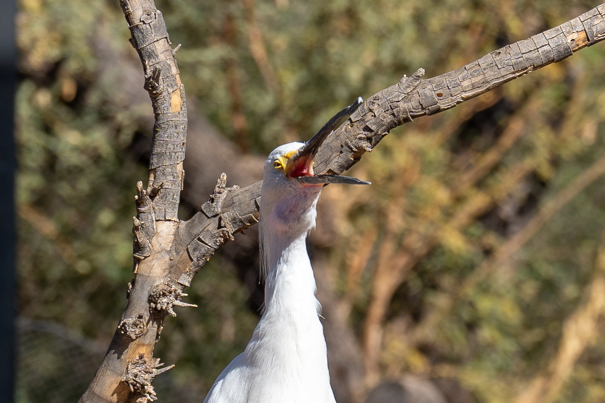

## 缘起

大概是第一次去 DC 的时候，我问三木有什么出行计划，因为他实在是太会旅游了，我觉得和他搭伴儿一起玩儿一定很不错。三木说他计划感恩节去巴黎、圣诞节计划去宝鸡。我遗憾地说：可惜两个都不在境内。  
三木：宝鸡在境内啊！  
我：啊？  
三木：Phoenix，你说是不是宝鸡吧！  
——你别说，还真是。于是自此之后我四处讲这个冷笑话，引得所有人都会先问一句：你冬天要回国吗？

因为我打定了主意跟着三木玩，所以可以说是几乎毫无准备，甚至航班时间和酒店都是照着三木的一通抄。具体去哪里我是只知道要跟一个一日游的团去大峡谷玩，甚至哪一天去都没定。出发前五天，我正在二鼓作气写我的 DC 游记的时候，三木发消息过来和我确定行程。顿时我的内心十分绝望：我的 DC 游记还没写完呢怎么就又要写宝鸡游记了！？！

> 我的 DC 游记最后还是在出发前写完了，走过路过不要错过 
>
> 

我们在 Phoenix 有三个整天的时间，最后决定第一天去大峡谷，接下来两天在城里转转，去沙漠植物园和乐器博物馆，其他地方看时间来不来得及再说。

## Day 0

### 谁旅游打一天明日方舟啊！

我第一天的飞机理应是是中午左右到，而三木要傍晚才能到，我就想着我到的那个下午找个什么地方玩玩。上网一搜发现那里有个乐高中心，虽然我对乐高的全部了解大概就是中学的社会实践课拼机器人和乐高蝙蝠侠大电影，但是作为一个心态十分幼稚的人，我还是想着买票去玩玩。结果谁承想，这地方必须要小孩和成人在互相陪伴下进入。当时感觉过于莫名其妙，上网一搜发现 reddit 网友说 Legoland Discovery Centre 是那种外包出去的场馆，不是真正的乐高公园。算了，只能以后再去加州或者佛州的时候再说了。

除此之外也在想去科技馆或者水族馆玩玩，甚至已经想好了我到了 Phoenix 的时候三木在中转，正是问他他更不想去哪一个我好一个人去的好时机。结果计划就是计划，我的下一程航班延误了，而且起飞时间屡屡往后推迟。我当时在等下一程直飞航班和换成另一班中转航班之间犹豫了一下，因为中转的航班早不了太多而且还要再中转，于是就还是决定等直飞的航班。后来上飞机听到空乘和其他乘客聊天才知道，原来是因为前序航班起飞的机场跑道结冰，一直在等除冰才晚点了四个小时。  
等待登机的时候我一直在疯狂刷新我和三木的航班信息，生怕我的航班延误到比他的还晚了。其实没人和我比，但是我总觉得我到得晚了我就输了 

于是在机场的这四个多小时，我开始狂打明日方舟。出发之前的这几天我的生活十分规律：早上起来看仙术杯，下午打明日方舟和折腾博客。看仙术杯看得我特别想打破坏战术分队拿死仇时代的恨意打一局，结果频繁去世之下还是用蓝图测绘分队打通了难度 12 的一结局。我不记得拿了什么加攻击的藏品，但是肯定拿了很多加攻速的藏品，于是寒芒克洛斯一套技能收了五个半不屈宿卫，非常爽！


<small> _萨卡兹肉鸽 ISW-NO 谋求共识，一通瞎打！_ </small>

到了 Phoenix 之后给公交 app 充钱。之前在 DC 充地铁卡的惯性还在，于是给 Phoenix 的公交卡啪地充了 25 块。充完之后先坐机场的 Sky train 去轻轨站，站在站外一看，因为有 Smart Fare 在，一天公交费用上限 4 块，而我在 Phoenix 最多也就待五天，就算每天坐公交也用不着 25。当然事后证明，Phoenix 的公交不咋好使，去哪儿还是主要靠打车，旅游结束之后公交 app 里还剩下 21 块钱。唉，我该知道的，美国南方公共交通几乎就是不存在的 

我的航班这一番晚点之后，也是傍晚才到，只比三木早到了不到一个小时。我去酒店办完入住，开始中英文并用地搜索 Phoenix 有什么好吃的。结果就是，还没有正式有一个景点清单的时候就已经有了一个饭馆清单了。等三木办完入住收拾完，我把我中英文并用的饭馆搜索结果发给三木，浅浅商量一下决定去所有推荐上都榜上有名的 Glai Baan。

### Glai Baan 名不虚传

据网上说，这家店广受欢迎很容易没有座位，但是可能因为我们到的时间比较晚，所以其实我们只是在门口等了十来分钟就在室外落座了。  
这家店可能太注重气氛了，所以只靠桌子上的一个小蜡烛和四周装饰的小彩灯照明。气氛是有了，但是太不实用了，菜单只能勉强看清楚！我借着昏暗的灯光勉为其难，三木干脆用手机拍照之后在手机上看。三木锐评道：仿佛真的在丛林里吃饭。

前菜要了一个肉末洋葱炒很多香料搭配一角大头菜的菜。按店员的话说就是加了一些椰浆，有点辣，有些 creamy 的口感。大头菜大概是东北方言，我说“竟然还有生大头菜”的时候，三木乍一听并没有理解。我换了个词，我说包菜。三木了然，他说他们就叫包菜，原因显而易见，因为这菜就是一层一层包着的。我确实不知道这位啥叫大头菜，可能因为很大一头菜，但是我家确实一直这么喊这种菜。这种称呼上的差别用小红书网友的话说，大概就是给南方人一些东北人震撼了。  
当然我给他的第一个东北人震撼大概是豆角。第一次起 DC 的时候我听说他很多时候不吃晚饭，酒就是晚饭的时候建议他炒个菜下酒，比方说豆角炒肉。我从切肉开始讲起，整个炒菜流程给他讲完之后，三木沉默了一下，然后问我什么是豆角。我也沉默了，我说：芸豆？三木还是十分茫然。这一时之间我也不知如何解释，于是上网搜了一个介绍豆角的文章，我看了也大震惊，竟然有八种豆角！三木看过之后也学会了，从那之后豆角这个词就入侵了他的词库。

我在外面吃饭非常喜欢点羊肉、鸭子和螃蟹，因为这些都是我在家不会做的东西。非常意外的是，这家店有鸭子汤米粉。点之前我以为是烤鸭店鸭子萝卜汤那种的鸭子汤，上来之后发现汤竟然是黑色的、味道很重的那种汤。原以为是鸭子汤\/米粉，没想到是鸭子\/汤米粉。不过，虽然和想像中的不一样，但是上面码着一排很嫩的鸭肉，下面米粉直接从汤里捞出来就很有滋味，真的很好吃！

还点了经典碳烤猪颈肉和牛肉咖喱，都是普通的好吃，而最惊喜的还是最后的海鲜炒饭。本来想要螃蟹炒饭，但是没有螃蟹了，于是在店员的推荐下点了当天特色海鲜炒饭。虽然似乎不应该这样形容一个东南亚餐馆，但是我在这道菜里尝到了我中学时代父母最爱带我去的一家日餐馆里的所有风味。尤其是里面的鱼肉，大概用的是秋刀鱼，有非常浓郁而别致的味道。整个炒饭非常鲜美，味道非常丰富。

吃完饭之后，我们一起去 Whole Foods 为第二天的大峡谷一日游准备吃的。下了 uber 之后我们四处找不到 Whole Foods 的门，于是我突然开始给三木讲：在我小时候我舅舅和我说，在公园迷路了怎么办呢？要找一堵墙，因为门在墙上，所以顺着墙就能找到大门。然后我问我舅舅，要是一直绕着一栋建筑物转圈该怎么办？我舅舅说你傻啊。  
大概是因为我们正在一栋建筑物上找门，这个故事就显得额外好笑，我边讲就没忍住一边笑出来了。最后这个绕墙找门任务十分成功，因为走到了正确的方向，只绕着建筑转了不到四分之一就找到了门。

我对于大峡谷荒山野岭的程度有些错误的过度估计，也对于我自己坐一天车的饥饿程度有错误的估计，在 Whole Foods 一番瞎买。我完全没有想到，第二天一日游团去程的某一站是一个小超市，在那里也完全能够买到当天需要吃的东西，而且大概会对自己能吃多少有一个更合理的估计。我在 Whole Foods 实在是买了过分多的东西，拿回家之后还又吃了好几天，截止目前还有若干坚果没有吃完 

## Day 1: 大峡谷

我和三木住的酒店是一日游接人的第一站，于是被我迫五点半起床、六点十分上车。我和三木一人拿着一个相机，占据了两个靠窗的单人座。隔着窗户我拍了很多当时很喜欢的景色，等回程的飞机上筛照片等时候才发现，光线暗的时候噪点完全压不住、光线好了之后车窗开始反光，总而言之就是没有一张能看的照片 

导游是一个美国西南本地人，我和三木都觉得这个人很难评。三木也说这位导游是他跟过的这么多一日游团里最离谱的一位。他讲地理小知识那些地壳怎么运动、岩层怎么形成、植被是什么样子的部分还是很有意思的，也还讲野生动物小故事吓唬人了一番（我就被吓唬到了），比如说他之前带的一个团里有一位女士被一只狂暴松鼠从衣服里跑到袖子口只为吃一口花生，好在没被咬人没事。但是除此之外，去程他先推销了很长时间看大峡谷的直升机，又宣泄了一些他对 National Park Service 的不满，还讲了很多他放弃各种工作只因为不愿意离开美国西南，回程又开始说占卜和 UFO，还说他业余时间爱好编程。唉，不是，说这些真的让人（我）毫无接话的欲望。

从市里去大峡谷还是很远的，导游车速已经十分疯狂了，开着十三座的车感觉都要起飞了，但还是在路上花了很久，留给大峡谷的闲逛时间也就三个多小时。  
来到大峡谷的第一站，我又去逛了纪念品商店。大峡谷的帽子都做得好好看，于是我又买了一个蓝色的帽子，还买了绝美水瓶子和加州神鹫书签。三木这次也买了个帽子，买之前三木说他没有很习惯戴帽子，我说这个戴着戴着就习惯了。三木真的买了，戴了差不多二十分钟之后，他说：我开始能感觉到和帽子的联结了。笑死了，但是确实是这样的，帽子戴着戴着就不习惯没有帽子了！

大峡谷还是很好看的，石头的层次十分分明。其实当时肉眼看感觉饱和度没有很高，但是回来之后我已经不是很记得当时看到的是什么样子的了，于是这个照片的颜色一通瞎调。




<small> _这个后期技术还是任重道远来日方长啊！_ </small>

因为当地缺水又温差大，所以有很多松树，树上还结了松果，非常可爱！




<small> _并非来自同一棵松树。图一是一棵悬崖边的松树，图二的松果来自一棵步道旁的松树。_ </small>

虽然在大峡谷待的时间没有很长，但是也见到了一些光影变化，有时候会突然间发现，阳光照得某一处石头好明亮，或者突然意识到这些岩石看起来额外红了。



<small> _两块明亮的石头，但是我调不出来 _ </small>

有旅伴的好处大概就是可以互相用对方的相机给对方拍游客照。三木用的相机比我的大一圈，他又设置同时按住 AF-on 和快门键才能自动对焦拍照，帮他拍完之后我说这相机好难捏啊，两个键离得好远抓不过来。三木满脸不可置信，左手托着镜头右手给我比划了三次两个键之间究竟有多近，我一时没好意思承认我忘了我左手托住镜头了右手不用非得抓着相机。

当然，把相机交给对方还是有风险的，不过这个风险并不在对方身上而在我身上。某一次，我把相机从腕带上拆下来给三木，三木拍完还给我，我接过相机，想着把帽子戴回去，我就习惯性地直接把相机撒手，毕竟腕带能兜住。结果我就忘我还没把相机挂回去，相机就直接被我扔到了地上。我倒吸一口凉气，我甚至听到了路过停住等我们拍照的游客也倒吸了一口凉气。我紧张地捡起相机挂回了手腕上，好在相机还能正常使用，甚至除了相机遮光罩上也不怎么看得出来划痕，万幸啊万幸   
从那之后，我再把相机交给三木就是整个腕带从手腕上拿下来下来交给他，甚至等三木抓稳了相机我托着镜头的手都迟迟不敢松开，搞得三木说了好几次他不会扔相机的。

拿着相机拍照片就总想四处走过去看看。一开始还是三木给我现场演示怎么借助位置欺骗视觉达到站在岩石边缘的效果，结果不知不觉，三木越走越远，真的站或者坐在了岩石边上。三木不以为然，我十分紧张。直到后来我们看到了大角羊。三木后来在路上的时候感慨，要是他坐在岩石边上的时候真的来一只羊给他撞下去了，他就真交代了。我（即答）：那我真的得去你坟头给你浇酒了。三木闻听爆笑。  
坟头浇酒这事可以追溯到第一次去 DC，当时我们两个一起吃了很多顿饭，每顿饭我都能看他喝一杯，晚饭之后还会特地去酒吧再来一杯。我作为一个曾经肝脏弥漫性损伤，后来不知道怎么超声结果又正常了的自认为肝脏脆弱人士，对于三木这种喝法很有异议。三木不以为然，颇有一种 whisky 下死做鬼也风流的感觉，于是我只好说：到时候我会记得去你坟头给你浇瓶酒的。三木闻之大笑，颇以为意地说：要好酒。


三木看完之后特地说他喝 scotch 比较多，但是实在是 whisky 三个音节念出来比较顺口，我就不改了！





<small> _不知道为什么，感觉羊看我的眼神充满慈悲。_ </small>

除了羊之外，还见到了很多狗和渡鸦。三木为了拍动物，特地背了 200-600mm 的镜头，只有一颗镜头的我只能望之兴叹，用 70mm 勉为其难。但是，非常巧，在一只渡鸦飞得很近的时候被我拍到了！70mm 能拍成这样，我十分满意 




<small> _乌鸦坐飞机！（雾）_ </small>




<small> _三张狗。因为最后我把相机收起来了，最下面这张 credit 三木。_ </small>

回程的时候路过一个叫 Sedona 的小镇停了半个多小时。这里有很多水晶商店，还有什么外星人混血小孩的都市传说。我和三木对此都毫无兴趣，就在城里随意闲逛了一下。城里有一个很酷的雕塑，一位女神站在蛋（？）上张开翅膀双蛇缠绕，很有一些 Rod of Asclepius 的感觉。




<small> _很酷的雕塑。_ </small>

晚上回到城里已经快八点了，本来想吃 BBQ，结果网上传说最好吃的那家店没开门，于是就去吃了中餐。刚进门的时候店员问我们要不要什么喝的，我出其不意地问三木想不想喝汤，于是最后点菜的时候要了一锅（锅）西湖牛肉羹、没要寻常饮料。  
因为点了西湖牛肉羹，三木就开始讲杭州名菜笑话：说起来西湖，那也要说西湖醋鱼，千万不要吃，太难吃了。如果非要吃，就要去楼外楼吃。  
我：我还真在楼外楼吃过西湖醋鱼，也很难吃。  
三木：要找一个靠窗的座位，吃一口，连盘子带鱼整个扔进湖里。你上次去是不是没坐到好位置。  
笑死我了！受教了 

因为一天没正经吃饭，晚饭要了过分多的菜，最后我和三木都撑得不行还剩下了三根蒜香排骨，三木把它们打包回去半夜下酒了。

## Day 2: ​​​​​​​​Papago Park​

第二天去了沙漠植物园、动物园和 Hole-in-the-Rock，当天这些地方都走完之后我才恍然意识到原来这些地方都算在 ​Papago Park​ 里。

沙漠植物真的很别致，之前在 DC 的植物园里就很喜欢带刺儿的植物，这次在沙漠植物园里见到了很多带刺儿的植物！有的刺儿很长看着像是植物长老，有的特别高，有的长得满地乱爬，还有七彩的仙人掌，还有的在头顶开得四面八方（这是什么小学生排比句）。唯一可惜的就是我忘记给 1939 年栽下的那棵仙人掌拍一张不带人的照片了，在那张照片面前，20mm 的优越真是尽数体现 




<small> _各种仙人掌。_ </small>

在沙漠植物园里，我们听到了鸟叫，三木再次掏出来他的 200-600mm 换上，而我依旧只能用 70mm 的焦距勉为其难。因为树很高、又有很多树杈和树叶，不仅很难找到鸟，找到鸟之后也很难找到了一个良好的角度。我们勉为其难了一番之后还是放弃，正往前走我突然指着天上的飞机说：这何尝不是鸟。三木用他的 600mm 拍了一张放大给我看，说：鉴定完毕，是 American Airlines 的飞机。  
当然三木换上了 200-600 的镜头之后就无法拍景了，所以中途这段找鸟找不到，景也拍不了的时候，三木拍了一些八十米开外的仙人掌，场面一度十分好笑。我问三木，难道背不同的镜头出门总要陷入这样来回换镜头的处境吗？三木说，终极解决方案是多准备一个机身。这话听得我简直大脑发光 




<small> _我用 70mm 勉为其难的结果，最后还混入了一架飞机。_ </small>

此外还看到了很多 fairy duster——这还是我写这篇博客的时候现搜才知道这种花叫什么。Wiki 上并没有中文页面，但是看有网友说这是精灵掸子，这个翻译还挺好笑的！我的小学旧址的校园里有一棵很类似的树，我的内心一直管这种花叫芙蓉。也是在写这篇的时候我又搜了一下，震撼地发现原来小学的那棵树是合欢啊！怎会如此！  
于是我去问我那位生日差半年的小学同学（没想到她又出场了！让我给她编个化名，就叫秋台吧！），秋台说：其实不是芙蓉，是拂绒，不知道是合欢的别名还是方言。我听了大震撼！给她连发了两个目瞪狗呆表情包！




<small> _左图的 fairy duster 上有只大蜜蜂；右图里能看清 fairy duster 的叶子，这个叶子和合欢还是很像的呢！_ </small>

逛植物园我也很发挥想象力，看到了一个像鹅的葫芦和一丛像蒜苔的草。牌子上写这丛草叫 slipper plant，但是我执意感慨它长得好像蒜苔！唉，好久没吃蒜苔了，好想吃蒜苔炒肉啊！蒜苔切段配肉丝，切丁就配肉末，甚至蒜苔炒鸡蛋也是好吃的   
我后来在和本科室友一年一度的新年电话上说起来了这件事，饱览晋江种田文的苏柰说：蒜苔是从大蒜里长出来的，你可以自己在家种。我听闻大惊，上网搜索了一番，可惜要土培不能水培，等我以后自己住了我必种蒜！




<small> _蒜苔（雾）和葫芦_ </small>

从植物园出来进了动物园，在动物园简单吃了个饭就接着逛起来了。一进门的地方有一个摸鹞鱼的池子，这是我之前去波士顿的水族馆的时候十分喜爱的一个活动，于是我兴高采烈地走过去。走近一看发现竟然是需要额外付费的项目，我又悻悻地走了回来。  
这个动物园真的很多收费的项目，还有一大项目是喂长颈鹿。虽然圈长颈鹿的那个院子十分大，但是因为有人在那里喂长颈鹿，所以长颈鹿一直站在喂长颈鹿的那边，其他方向拍长颈鹿太远了，喂长颈鹿那边拍长颈鹿太多人和围栏遮挡了。三木用他 600mm 的镜头耗时十分钟得意地给我展示他拍到的无敌清晰长颈鹿头，唉，逛动物园真的还是需要超长焦呢，我现在好想买镜头呢！




<small> _70mm 勉为其难的长颈鹿。吐舌头真的好有趣！_ </small>

当然我对于我的镜头也不是完全不满意，毕竟还是可以拍清楚这两只鸭子的中午饭是黄瓜 




<small> _鸭子吃饭。_ </small>

还拍了一些鸟，不同姿势的鸟仿佛有不同的表情，可爱呢！



<small> _前两张是雪鹭，中间两张是鹰，最后两张是加州神鹫。虽然最后一张焦又对在树上了，但是还是好喜欢这个展翅的动作！_ </small>

有的小鸟真的非常漂亮，但是它们外面的铁丝网实在是过于密集，于是我手动拧对焦环对了几只鸟。虽然因为很多铁丝网观感还是很差，但是毕竟是我亲自拧对焦环拧出来的照片，我必须要放出来！




<small> _超级喜欢最后一只小鹦鹉，感觉看起来长得很礼貌。_ </small>

还拍了一些其他非常可爱的小动物。猴子是在一处可以进去的猴园拍的，真的可以离猴子非常近。进去之前听到工作人员说这群猴终于平静下来了，之前一段时间满地都是四处窜得飞快。拍狮子的时候颇有些遗憾，当时下面正好有只小狮子在玩儿一个桶，但是因为角度不好没有拍到。绿蓑鸠因为喙上有节，看起来十分博学。草原犬鼠住的附近有一些爬行动物的展柜，我对爬行动物十分犯怵，但是来都来了还是看了一圈。看完爬行动物再看到毛绒绒的草原犬鼠，还是没忍住多逗留了许久。




<small> _猴子、狮子、绿蓑鸠和草原犬鼠。_ </small>

动物园四点就关门了，从动物园出来去了附近的 Hole-in-the-Rock。据说这里是看日落的好地方，但是那天空气质量十分差，远处雾蒙蒙的。我和三木对在这样的天气看日落也都没什么执念，于是上去看了一眼简单拍了点照片就离开了。出乎我的意料的是，透过洞拍外面的景比进到洞里往外拍更好看，但是回来看一看感觉没有一张拿得出手的，于是这个环节只有一张 Hole-in-the-Rock 本体的图。




<small> _Hole-in-the-Rock_ </small>

晚上去吃了 Pizzeria Bianco，十分失望，还是 L'Ardente 的羊肉披萨好吃。  
我十分没数地撺掇三木要了两个披萨和一个前菜的各种东西拼盘，因为没想到前菜的拼盘那么多，最后剩了半个披萨。前一天三木拿了蒜香排骨回去，这次我拿披萨回去，风水轮流转啊！

因为三木在我上一篇博客里友情出场，于是我把那篇博客发给他看了。看完之后他委婉地表达了我放进去的照片太丑了的意思，他说：我觉得 editing 还是很重要的。  
那按照常听的评书里的话说就是“遇高人不能交臂而失之，入宝山岂能空手而还”，我就问三木能不能观摩他修图的过程，三木欣然同意。可能三木并不觉得，但是我感觉我要是真的全程盯着他修图，他可能多少有点考试被监考老师盯着写题的感觉，于是第一天我看他修了一张风景照，第二天看了一眼他选出来的 raw，然后去他的 ig 看成品。  
看完之后确实颇有一些心得：比如说不要害怕裁照片，像素那么高就是为了让人裁的；比如说修之前点个 auto 看看，preset 该用就用，用完再调就行，不用每张照片非得自己从头来；比如说三木拍的照片景确实选得好、焦确实对得准啊，十年经验不是白来的；比如说拍了十年有时候也会虚焦，虚了就删了不要留恋；比如说社交平台就是让人看个热闹，LrC 里相机里看不管怎么中心放大 100%，导出的时候导个几百 K 的就行了。  
总之在这样的氛围下，我回到我的房间之后开始阅读 adobe 官网 LrC 的教程，未曾想到！

## Day 3: 乐器博物馆

最后一天的行程安排得十分混乱。本想上午去乐器博物馆，然后吃个传说中 Phoenix 最好吃的 Little Miss BBQ，下午再去 Heard Museum，再看看 ASU 美术馆的楼，晚上吃广受好评的墨西哥菜 Bacanora。结果最后只去了乐器博物馆、吃了顿不是 Little Miss 的 BBQ、看了眼 ASU 美术馆的楼。

乐器博物馆还是太好玩了，九点左右到的，一直待到了快下午两点才走。中间无数次我一边说我饿死了急需 BBQ，但是一边站在展品面前不愿离开。乐器博物馆的展品非常多，有很多非常别致的乐器：有顶天立地的大提琴；有各种奇形怪状的琴身；有的乐器看着是个锅，其实上面能分出来不同的音符；甚至还有一个乐器是锯！




<small> _各种乐器。_ </small>

除了乐器之外还有很多电视播放乐器片段，戴上博物馆配套耳机走进就能自动连上音频。走到亚洲乐器的展区，我颇有种故地重游的感觉。我本科的时候在学校的民乐团混迹了三年，虽然我啥民族乐器都不会，但是因为识谱，所以在打击乐声部打大镲铙钹小锣这种非常边缘的打击乐器。很难说这段民乐团经历让我喜欢上民乐，但是确实非常喜欢两首我称之为西域小调的室内乐。一首叫《茶马》，一首叫《敦煌》。

> 以防 youtube 非说人是 bot 不让看，视频下面注释的曲名上加了链接，欢迎大家去听！


<small> _[《茶马》](https://youtu.be/2HI1lE2pFPo)，我无敌喜欢三分半左右开始进打击乐之后的那段！_ </small>


<small> _[《敦煌》](https://youtu.be/NXMawUaB9KQ)_ </small>

一楼还有一个超大八音盒，正午十二点的时候还有真机演示，最上面的一排乐器真的在演呢！据工作人员说，以前是真的把纸质谱子塞进去那么演奏的，但是因为纸太脆弱了，所以后来一家公司给谱子电子化了，从此就变成了电子演奏了。


<small> _巨大音乐盒演奏的一首曲子的一部分。_ </small>




<small> _完全不会（也暂时不太想学）给视频做后期，但是音乐盒的颜色并没有视频里那么惨淡。_ </small>

博物馆里还有一些服饰，我感觉这两个十分别致！尤其是右边那个，好像派大星啊。



<small> _两件衣服。_ </small>

离开博物馆之后，打车去 Little Miss BBQ，到了门口发现竟然不开门！大意了啊，打车之前应该再查一次的！明明两天之前查谷歌地图说是开门的，结果被背刺！于是我们在 Little Miss BBQ 门口重新打车去另一个评价也还不错的 Bobby-Q BBQ。唯一有一丝安慰的是，我们在 Little Miss 门口等车的时候发现还有别人误以为开门开车过来之后又无奈离开的，好好好，被骗的不只是我们。  
这么一通折腾之后，真的到了 Bobby-Q 已经快三点了，吃完也将近四点了。而这次三木也在我的撺掇之下我们一起点了一个超级大盘的烤肉拼盘。当然这也不能完全怨我，因为菜单上竟然还写一个人吃也行，分享也行。我们当时感觉再来两个人估计才能吃完，究竟为什么菜单上会写一个人吃也行啊！最后实在无法吃完，我们打包了两个盒子带回酒店接着当晚饭吃。三木最后感慨道：每顿饭点菜都大意，真是每天都有剩饭吃。可恶啊，还真的是，第一天剩了蒜香排骨，第二天剩了半个披萨，最后一天剩了烤肉，可不是每天都有剩饭吃   
但是 Bobby-Q 还是很好吃的，据品尝过绝美 San Antonio 烤肉的三木说，虽然炭火烟熏的味道淡一点，但是能达到绝美烤肉的 80%（80%是我猜的）。

因为 Heard Museum 也是下午四点关门，吃完饭之后不太来的急了，于是我们就去 ASU 美术馆。ASU 美术馆当天也不开门，但是因为据说楼很有特色，我们就还是去了一趟。  
三木不知道从哪里看的，说这个红色的砖泼上水之后颜色很特别，于是我们在两个不同的位置往砖上泼了点水。等了半天我也没看出来有什么特别的，就是普通砖湿了的颜色罢了。  
楼确实很好看，但是我和三木一致认为这里的气候太不适合上六年学了——冬天我穿短袖，夏天据说像烤箱，空气质量还不好。三木锐评道：要是我真的在这里读六年博士，那估计 Phoenix Sky Harbor Airport 将是我最喜欢去的地方 




<small> _ASU 美术馆的楼和外面的一个雕塑。_ </small>

因为下午这个饭吃得太撑了，我们晚上的墨西哥餐厅计划也告吹了，最后一天就这样在下午五点钟提前结束了。因为我和三木前几天住这个酒店最后一晚点数太贵了，我们最后一天就换到了不同酒店。三木选了一个离上一个酒店比较近的，我选了一个离机场比较近的。事实证明，住离机场近真的是一个巨大的错误！一方面因为第二天中午又去东边吃了个中餐，另一方面因为机场附近实在是太吵了。

## Day -1: 回程

我回程是下午的飞机，刚好够再吃一顿中午饭。发现有一家卖煲仔饭的，我就自己打车去吃了。要了豉汁排骨的煲仔饭，还要了杯现榨的豆浆，非常好吃。不过估计因为店家榨豆浆一次能榨好多杯，我点完之后店家总会和新顾客问一句要不要现榨的豆浆。诶嘿，便宜我了

Phoenix 的机场人也不是很多，过安检也十分迅速。这次安检排队的时候听后面的旅客聊天的时候发现，原来大一点的安检机器不用把电子产品拿出来，小一点的那种才需要拿出来啊！学会了，以后就挑大一点的机器去排队！

啊！旅游真好玩啊！刚回来那几天简直想一个月出门旅一次游。不过回来之后狂看仙术杯了好几天之后，再一次写了三天才把游记写完，边写边觉得一个月写一次游记还是太难了，我看一年旅个三四次游可能是个很好的频率！

> 依旧没有解决 gallery 里的图点出来只有高糊大图的问题，再次附上[repo](https://github.com/BrightSpells/BrightSpells.github.io/tree/main/content/zh-cn/posts/travel_phoenix_2024-12-25/images)链接！
